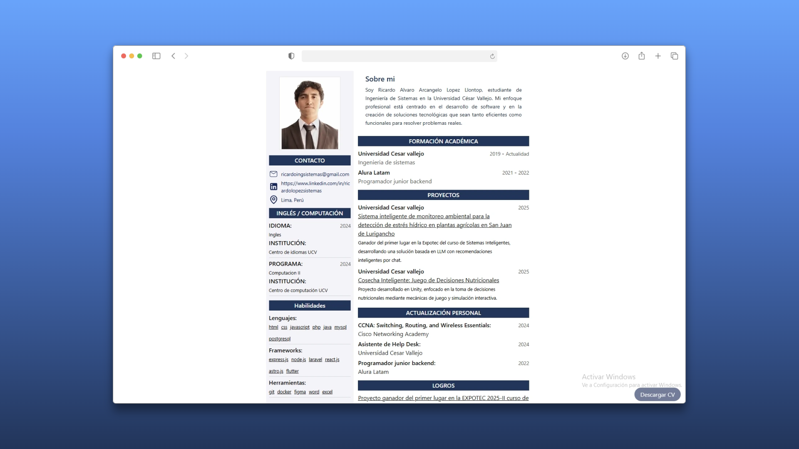

# Ricardo López – CV Web

---

## 📄 Descripción

Este proyecto es mi **CV web interactivo**, creado con:

- **Astro** (SSG/SSR híbrido)
- **TailwindCSS** para estilos rápidos y responsivos
- **Puppeteer** para generar el PDF desde el sitio
- **Server Output (SSR)**, desplegable en **Vercel**  

El CV incluye secciones de contacto, sobre mí, educación, proyectos, cursos y habilidades, con generación de PDF lista para descargar desde el navegador.

---

## 🧰 Tech Stack

